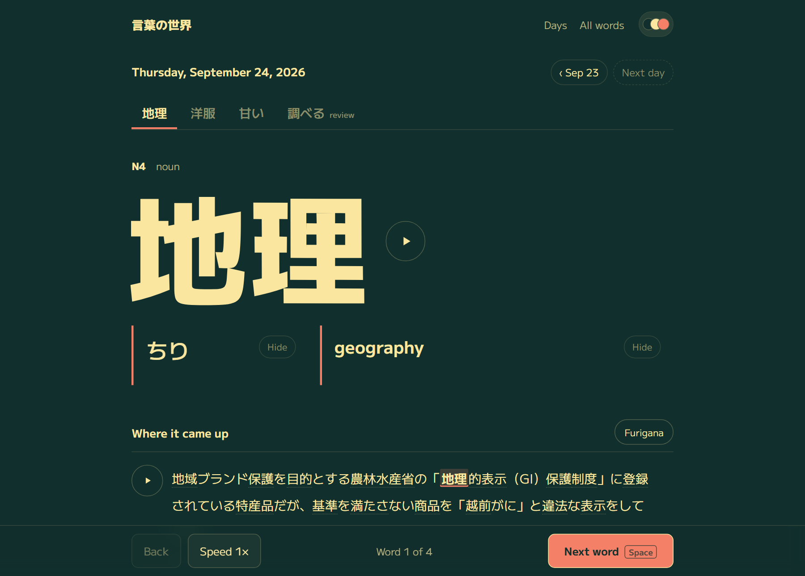
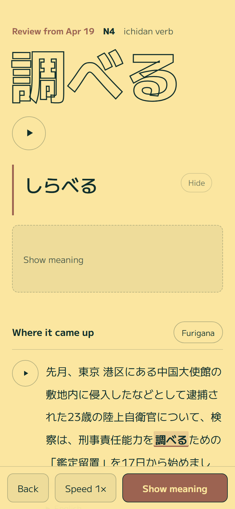
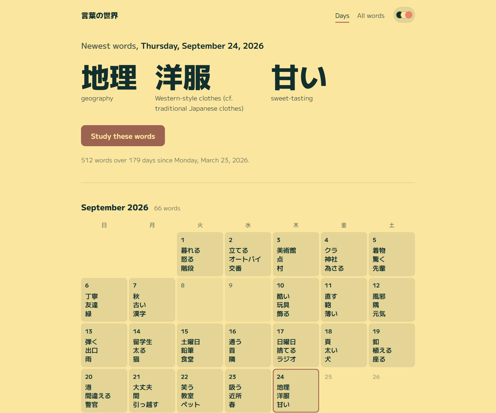
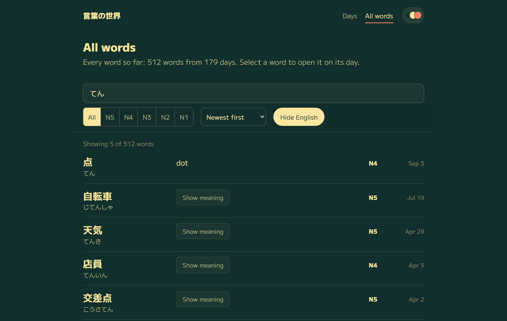

<div align="center">

# 言葉の世界 Kotoba no Sekai

**A few real Japanese words a day, taken from today's news.**

Reads Japanese news and graded-reader feeds, picks new words at your JLPT level, and publishes a daily study page. Each word comes with its reading, meaning, audio, and the sentences it actually appeared in.


[](LICENSE)

[How it works](#how-it-works) · [Quick start](#quick-start) · [CLI](docs/CLI.md) · [Configuration](docs/CONFIGURATION.md) · [Publishing](docs/PUBLISHING.md)



<table>
  <tr>
    <td width="26%"></td>
    <td width="37%"></td>
    <td width="37%"></td>
  </tr>
  <tr>
    <td align="center"><sub>Review words come back in outline</sub></td>
    <td align="center"><sub>Every day on a calendar</sub></td>
    <td align="center"><sub>Search every word, or hide the English to test yourself</sub></td>
  </tr>
</table>

</div>

## What it uses

Only the dictionary and the feeds are needed. Everything else is optional, and the pipeline keeps working without it.

| What | Service | Needed? |
|---|---|---|
| Articles | RSS feeds and JSON APIs listed in `sources.yaml` | Yes |
| Meanings, parts of speech, JLPT levels | [Jisho.org](https://jisho.org/) API, which serves [JMdict/EDICT](https://www.edrdg.org/wiki/index.php/JMdict-EDICT_Dictionary_Project) with JLPT levels from [Jonathan Waller's lists](https://www.tanos.co.uk/jlpt/) | Yes. Free, no key, rate-limited to one call per 1.25 s |
| Word splitting and furigana | [kuromoji](https://github.com/takuyaa/kuromoji.js), bundled | Yes, runs locally |
| Sentence translation | [Ollama](https://ollama.com) running locally (`translategemma:27b`), or Google Cloud Translation | Optional |
| Audio | [ElevenLabs](https://elevenlabs.io/) or OpenAI text-to-speech | Optional. Without it, the browser speaks the text |
| Hosting | AWS S3 + CloudFront (template included) or Cloudflare R2 | Optional. The site is plain HTML files |

The site loads its fonts (M PLUS 1) from Google Fonts. There's no other JavaScript framework or build step for the pages; each one is a single HTML file.

## Colors from Wada Sanzo

The site's colors come from [*A Dictionary of Color Combinations*](https://en.wikipedia.org/wiki/Sanzo_Wada), Wada Sanzo's 1930s study of color pairings, still in print. The swatch button in the header opens a palette picker with six of his three-color combinations (the default is No. 166: deep slate green, Naples yellow and grenadine pink). Each combination supplies the background, the text and one accent, and every other shade on the page is mixed from those three. Light and dark modes swap the background and text, and you can mix your own.

## How it works

Once a day the pipeline:

1. **Reads the feeds** in `sources.yaml` (NHK News, NHK Web Easy, Asahi Shimbun and Watanoc by default), shuffled so the words come from different topics.
2. **Finds candidate words** by splitting each article into words with [kuromoji](https://github.com/takuyaa/kuromoji.js), a Japanese morphological analyzer, and keeping nouns, verbs and adjectives.
3. **Keeps the ones worth learning.** A word must be new to you (tracked in a local SQLite database), have a dictionary entry, match your JLPT level, and appear in a usable example sentence. It takes at most one word per article.
4. **Adds what you need to study it:** furigana for every word in the example sentence, a translation of the sentence, and audio of the word and sentence at three speeds.
5. **Brings back one earlier word** for review, starting with the oldest words that haven't been reviewed yet.
6. **Writes the site** and, if configured, uploads it to S3 or R2.

### The study page

- **One word at a time.** The reading and meaning stay covered until you ask, and the main button steps you through: show the reading, show the meaning, next word. Space does the same. A "Hide" button covers them again.
- **A length hint.** The covered reading shows one circle per kana, with a smaller circle for small kana like ょ.
- **Where it came up.** The real sentences from the article, with the word highlighted, furigana on tap or always on, the English behind a disclosure, and a link to the article (plus a saved copy in case the link dies).
- **Forms.** Adjectives and nouns get a table of their plain and polite forms (negative, past, te-form and so on), with the form used in the sentence highlighted.
- **Audio** at normal, slow and slower speeds. It falls back to the browser's own speech when there's no recording.
- **Days and All words.** Every past day is on a calendar. All words can be searched in kanji, kana or English, filtered by JLPT level, and switched into a self-test with the English hidden.

It also writes an Anki-ready JSON file and a Markdown digest each day.

## Quick start

You need Node.js 20.6 or newer.

```bash
npm install
npm run build
npm start
```

Open `output/web/index.html`. The first run collects words at the `beginner` level (JLPT N5 and N4). Change that, the number of words per day, or the feeds in [Configuration](docs/CONFIGURATION.md).

For translations, run Ollama locally or put a `GOOGLE_API_KEY` in `.env`. For recorded audio, add `ELEVENLABS_API_KEY` or `OPENAI_API_KEY`. `.env.example` lists every setting.

To study a word you choose, run `npm start -- --word 食べる`. [CLI](docs/CLI.md) has every command.

## Docs

- [CLI](docs/CLI.md): commands, output files, how words are chosen, and the data format
- [Configuration](docs/CONFIGURATION.md): `config.yaml`, `sources.yaml` and environment variables
- [Publishing](docs/PUBLISHING.md): S3 or R2 hosting, the daily scheduled run, and Docker

## License

The code is [AGPL-3.0](LICENSE). You can use, change and self-host it. If you run a modified version as a public site, you must publish your changes under the same license.

The license covers the code, not what the site publishes. Dictionary data in the pages and JSON is JMdict, under its own [CC BY-SA 4.0 licence](https://www.edrdg.org/edrdg/licence.html), and example sentences and article text belong to their publishers.

## Credits

Dictionary data comes from the [JMdict/EDICT](https://www.edrdg.org/wiki/index.php/JMdict-EDICT_Dictionary_Project) files, the property of the [Electronic Dictionary Research and Development Group](https://www.edrdg.org/), used under the Group's [licence](https://www.edrdg.org/edrdg/licence.html) and looked up via [Jisho.org](https://jisho.org/). JLPT levels are from [Jonathan Waller's JLPT Resources](https://www.tanos.co.uk/jlpt/). Example sentences belong to their publishers; each page links back to the article.
